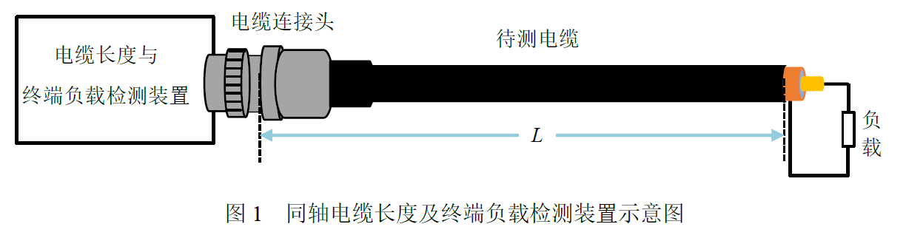
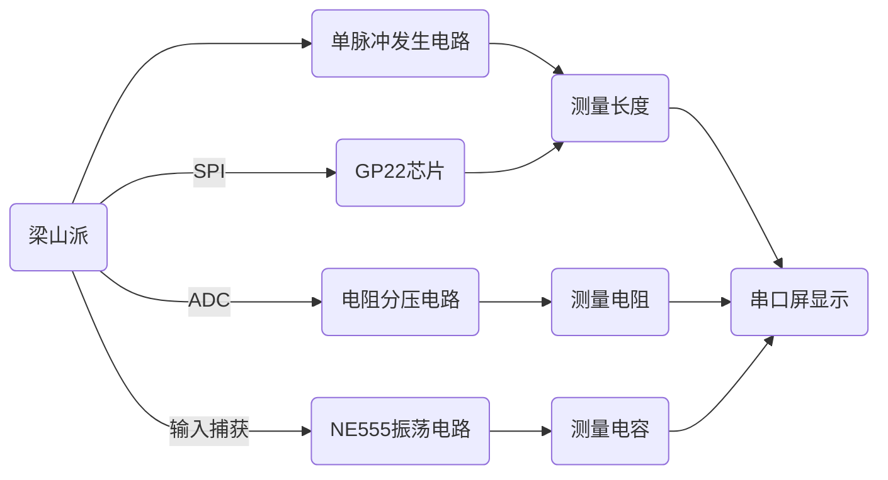
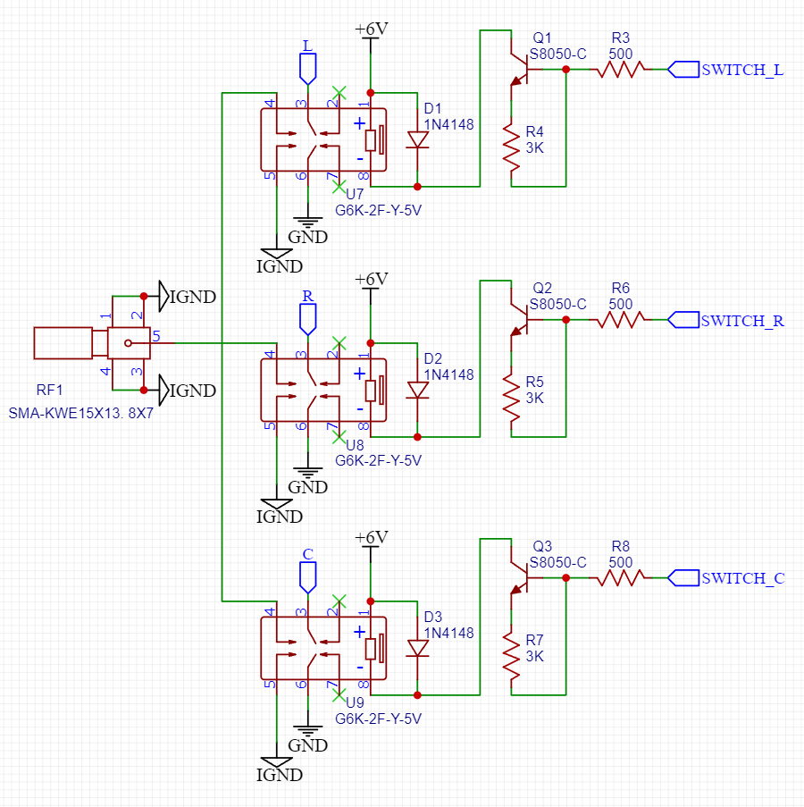
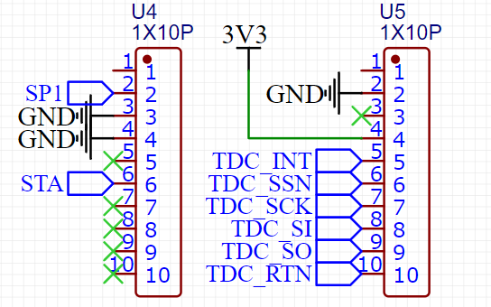
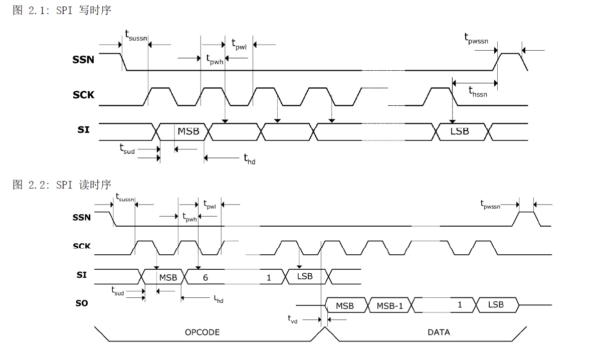
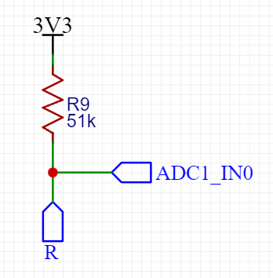
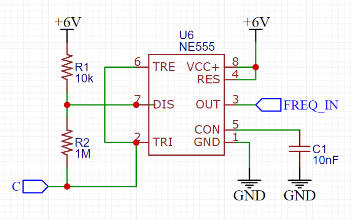
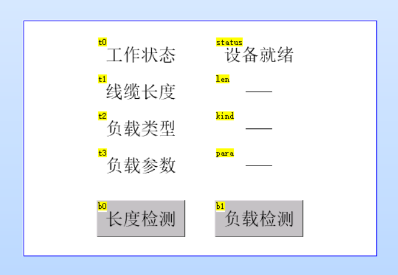

# 同轴电缆长度与终端负载检测装置

本装置可测量：同轴线缆的长度、终端电阻负载、终端电容负载。

主控使用梁山派开发板，代码开发环境为STM32CubeMX+CLion+OpenOCD。

长度测量采用TDR时域反射法，误差小于0.5cm；电阻负载测量使用分压法，误差小于0.1Ω；电容负载测量使用NE555振荡电路，误差小于1pF。


## 一、题目要求

设计并制作一个同轴电缆长度与终端负载检测装置，如图1所示。待测电缆始端通过电缆连接头与装置连接，电缆终端可开路或接入电阻、电容负载。 设置“长度检测”和“负载检测”两个按键，用以选择和启动相应功能。负载电阻值范围 10Ω\~30Ω 电容值范围 100pF\~300pF。 装置由不大于6V的单电源供电。



基本要求

1. 10m ≤ 线缆长度 ≤ 20m，终端开路，测量长度，误差不大于 5%
2. 保持长度不变，终端接入电阻或电容负载，正确判断负载类型

发挥部分

1. 10m ≤ 线缆长度 ≤ 20m，终端开路，测量长度，误差不大于 1%

2. 保持长度不变，终端接入电阻或电容负载，正确判断负载类型并测量值，误差不大于 10%

3. 线缆长度 ≤ 1m，测量长度，误差不大于 1%


## 二、技术方案

线缆长度测量使用TDR时域反射法，电阻测量使用分压法，电容测量使用NE555振荡电路。



长度、电阻、电容的测量通过三路信号继电器来切换




### 1. 长度测量

#### 1.1 原理

长度测量使用TDR时域反射法，其原理是：信号在传输线中阻抗反射变化的位置会发生反射。在本题中，同轴线缆终端开路，开路阻抗为无穷大。信号会在此处发生反射。

因此，我们可以产生一个窄脉冲输入传输线，这个窄脉冲到达传输线末端后会发生反射。如果在起始段放置一个示波器，则会看到两个脉冲。根据两个脉冲的间隔时间，便可求得同轴线缆的长度。设两个脉冲的上升沿间隔为 $T$ , 则线缆长度
$$L = 速度因子 * T * c / 2$$
其中 $c$ 为光速。值得一提的是，同轴线缆中的光速小于真空中的光速，所以需要乘上一个“速度因子”。同轴线缆中这个值一般为69%。

#### 1.2 GP22芯片

接下来就是要解决如何准确测量脉冲时间差 $T$ ，这个值一般很小。对于10米的同轴线缆，这个值的数量级大约在 $100ns$。有一款叫做 TDC-GP22 的芯片可以实现微小时间差的测量。其核心原理是利用了信号通过逻辑门的延迟，并配合晶振进行更长时间的测量。其时间测量分辨率为 $90ps$，这个值对应约9mm的分辨率，但可以通过多次测量取平均来获取更高精度。



单片机与 GP22 芯片之间使用SPI通信，相关引脚如下：

- SCK：SPI时钟，空闲时钟为低电平，数据在第二个时钟沿
- SO：从机发送、主机接收
- SI：从机接收、主机发送
- SSN：从选，低电平有效
- INT：中断引脚，低电平有效
- RTN：硬复位引脚，低电平有效

SPI读写时序如下：



使用GP22测量的流程如下：

1. 芯片复位：硬复位为拉低RTN引脚，软复位为SPI发送0x50

2. 复位后配置寄存器决定运行模式，该芯片的寄存器功能较多，具体功能可阅读数据手册。我的配置如下，这个配置可实现：检测start和stop引脚上第一个的脉冲，计算stop-start的时间差。计算完成后会通过IO中断的方式通知单片机。

| 地址 | 寄存器值 |
| ---- | -------- |
| 0x80 | 0x009420 |
| 0x81 | 0x010100 |
| 0x82 | 0xE00000 |
| 0x83 | 0x080000 |
| 0x84 | 0x200000 |
| 0x85 | 0x080000 |

3. 发送 0x70 启动测量。
4. 等待RTN中断引脚变低，表示测量完成。
5. 发送 0xB0 读取测量结果，会收到一个32bit的数据，这是一个定点小数。高16bit为整数部分，低16bit为小数部分。

6. 将读取到的数值除以4MHz(晶振的频率)，即可得到测量的结果，单位为秒。

相关代码可查看工程文件中的：`User/tdc.c` 文件，这个文件实现了GP22芯片的驱动（软件SPI）。

#### 1.3 数据处理与标定

GP22芯片测量时间的分辨率仅有 $90ps$，对应长度分辨率约为 $9 mm$ ，已经基本满足题目的要求。我们使用了测量100次取平均的方法，最终精度优于 $5mm$。

对装置的标定也是必不可少的，误差主要的来源是线缆的速度因子不准确。我们使用多种已知长度的线缆进行标定，并拟合曲线，最终测得：

同轴线缆中的光速约为： $2.01546 * 10^8 \ m/s$

速度因子约为： $67.2285 \%$

需要说明的是，不同厂家生产的同轴线缆速度因子所有差异。例如我买来两家10米的线缆，用其中一根标定后，另一根在10米的时候会累计2~3cm的误差。但同一家同一批买来的线缆，速度因子基本一致。

标定的代码位于工程文件的：`User/getL.c` 文件


### 电阻测量

#### 1. 原理



电阻测量使用分压法，使用定值电阻和同轴线缆串联接入 $3.3V$，通过ADC测量分压计算阻值。
$$\frac{v}{R_x} = \frac{3.3V - v}{R}$$
其中 $R_x$ 为目标电阻。 $v$ 为ADC测量的分压， $R$ 为定值电阻，我们选取的值为 $58.5 Ω$ （LCR测试仪实测值）。

值得注意的是，这里测得的目标电阻为同轴线缆本身的电阻和终端负载的串联电阻。由于同轴线缆电阻分布均匀，可以根据之前求得的长度计算同轴线缆本身的电阻。

#### 2. ADC采集程序

我们使用单片机内部ADC电压，相关代码如下（程序使用HAL库编写）：

```c
// 获得单次ADC测量的原始值
uint16_t getADC() {
    HAL_ADC_Start(&hadc1);
    HAL_ADC_PollForConversion(&hadc1, 50); // 等待转换完成，50为最大等待时间，单位为ms

    if (HAL_IS_BIT_SET(HAL_ADC_GetState(&hadc1), HAL_ADC_STATE_REG_EOC)) {
        uint16_t ADC_Value = HAL_ADC_GetValue(&hadc1);
        return ADC_Value;
    } else {
        return 0;
    }
}
```

这个函数获取的是ADC测量的原始值，这是一个介于0~4096之间的值。如果使用默认的3.3V参考电压，换算成电压的公式为：
$$v = 3.3 * \frac{value}{4096}$$


其中 $v$ 为换算后的电压 $value$ 为 ADC 的原始值。

相关代码可查看工程文件中的：`User/getR.c` 文件

#### 1.3 数据处理与标定

为了避免偶然误差，我们最初使用了测量100次的平均结果。为了达到最好的效果，我们也进行了充分的标定。

需要标定的项目有三个：

- ADC的测量误差
- 电阻测量的误差
- 线缆的寄生电阻随长度的关系

我们通过大量的数据拟合发现，以上三种均具有很好的线性度，所以最终采用一次函数拟合。

- ADC测量纠正函数，这里发现误差不是很大
  $$y = 1.0072 x - 0.0007$$

- 电阻测量纠正函数
  $$y = 0.8615 x - 0.1298$$
  这里误差较大的原因可能是：分压电阻在焊上之前测量值是 $58.5Ω$，焊上后再测量大概是 $51Ω$，这两个值的比值在 $0.87$ 左右，和上面的 $0.8615$ 很接近。我们猜测是第一次测量的时候接触不是很好，产生了误差。
  
- 线缆寄生电阻(Ω)随长度(m)的关系
  $$y = 0.14x + 0.0328$$
  这意味着平均每1米的同轴线缆，会有约 $0.14Ω$ 的寄生电阻。后面的常数项 $0.0328Ω$ 可能是由于接头处电阻导致的。

标定的代码位于工程文件的：`User/getR.c` 文件


### 电容测量

#### 1. 原理

电容测量使用NE555振荡电路，通过测量振荡频率来计算电容值



该电路的振荡频率为
$$f = \frac{1}{\ln2*({R_1+2R_2})*C_1}$$
最终我们选取 $R_1 = 10KΩ$, $R_2 = 1MΩ$

#### 2. 测量频率

我们使用单片机的IO中断功能测量频率。每次进入中断后，会记录当前系统内核级的时间戳，并根据上一次进入中断的时间计算频率。

这种方法相比较于定时器输入捕获的方法，有两点好处：1. 由于采用内核主频的时间戳，比定时器有更高的精度。2. 不消耗定时器资源。

但这种方法不适合计算低频信号的频率，因为主频时钟较高，计数器溢出时间较短。

获取系统级时间戳是使用了DWT外设，这个外设在使用前需要先使能，相关代码如下：

```c
#include "tick.h"

#define  DWT_CR      *(uint32_t *)0xE0001000
#define  DWT_CYCCNT  *(uint32_t *)0xE0001004
#define  DEM_CR      *(uint32_t *)0xE000EDFC

#define  DEM_CR_TRCENA                   (1 << 24)
#define  DWT_CR_CYCCNTENA                (1 <<  0)

/* 初始化时间戳 */
void Tick_Init(void) {
    /* 使能DWT外设 */
    DEM_CR |= (uint32_t) DEM_CR_TRCENA;

    /* DWT CYCCNT寄存器计数清0 */
    DWT_CYCCNT = (uint32_t) 0u;

    /* 使能Cortex-M3 DWT CYCCNT寄存器 */
    DWT_CR |= (uint32_t) DWT_CR_CYCCNTENA;
}

uint32_t Get_Tick(void) {
    return ((uint32_t) DWT_CYCCNT);
}
```

以上代码位于工程文件的：`User/tick.c` 文件

#### 1.3 数据处理与标定

为了达到更好的效果，我们也使用了测量100次取平均的结果。但与之前不同的是，由于频率的计算是在中断内完成，无法通过循环逻辑实现取平均。为此，我们维护了一个长度为100的先入先出队列。当需要计算频率时，统计队列内的平均值即可。

和上文的电阻测量类似，这里测得的电容是同轴线缆的寄生电容和负载电容的并列电容。我们也进行了充分的标定。

需要标定的项目有三个：

- 频率的测量误差

- 电容测量的误差

- 线缆的寄生电容随长度的关系

我们通过大量的数据拟合发现，以上三种均具有很好的线性度，所以最终采用一次函数拟合。

- 频率测量纠正函数，这里发现误差不是很大
  $$y = 1.0048 x - 0.0501$$

- 电容测量纠正函数
  $$y = 1.0031 x - 36.6104$$
  这里线性误差不是很大，后面的常数项误差可能是测量电路的寄生电容导致的
  
- 线缆寄生电容(pF)随长度(m)的关系
  $$y = 95.27x + 1.4487$$
  这意味着平均每1米的同轴线缆，会有约 $95.27pF$ 的寄生电容。后面的常数项 $1.4487pF$ 可能是由于接头处电容导致的。

标定的代码位于工程文件的：`User/getC.c` 文件


### 串口屏交互

装置的操作和显示使用陶晶驰的T1 3.5寸串口屏完成，布局如下



当按下“长度检测”按钮后，串口屏会想单片机发送0x61。

当按下“负载检测”按钮后，串口屏会想单片机发送0x62。

单片机通过发送以下格式的指令，来改变文本框显示的值

```
len.txt="1000.00 cm"\xff\xff\xff
```

其中 `\xff` 表示 ASCII 码 0xFF。


## 三、效果展示

### 装置照片


### 各部分功能


### 测量范围、准确度

| 项目 | 范围        | 准确度                      |
| ---- | ----------- | --------------------------- |
| 长度 | 0mm ~ 100m  | 分辨率0.01cm，误差小于0.5cm |
| 电阻 | 0pF ~ 100nF | 分辨率0.1pF，误差小于1pF    |
| 电容 | 0Ω ~ 1000Ω  | 分辨率0.01Ω，误差小于0.1Ω   |

### 实际测量数据

#### 长度

| 实际值 | 装置测量值 | 相对误差 |
| ------ | ---------- | -------- |
| 1949cm | 1948.99cm  | 0.0005%  |
| 1550cm | 1549.73cm  | 0.0174%  |
| 1050cm | 1049.98cm  | 0.0019%  |
| 190cm  | 189.81cm   | 0.1000%  |
| 90cm   | 90.04cm    | 0.0444%  |
| 50cm   | 49.96cm    | 0.0800%  |
| 30cm   | 30.02cm    | 0.0667%  |
| 20cm   | 19.94cm    | 0.3000%  |
| 10cm   | 10.01cm    | 0.1000%  |

#### 电阻

| 实际值   | 装置测量值 | 相对误差 |
| -------- | ---------- | -------- |
| 19.9986Ω | 19.961Ω    | 0.1880%  |
| 9.9751Ω  | 9.964Ω     | 0.1113%  |

#### 电容

| 实际值    | 装置测量值 | 相对误差 |
| --------- | ---------- | -------- |
| 203.672pF | 203.15pF   | 0.2563%  |
| 101.381pF | 101.54pF   | 0.1568%  |


## 四、关于附件

本项目附件托管在Github上：https://github.com/xzqiaochu/CableMeasure

如果你是从立创开源平台访问的，也可以在附件中下载

附件中的 `CableMeasure` 为代码工程文件，使用 STM32CubeMX+CLion+OpenOCD 开发。我们的代码位于其中的 `User` 文件夹下，以下为文件的功能：

- user.c/.h：程序会先执行一次其中的 `setup()` 函数，然后循环执行其中的 `loop()` 函数
- printf.c/.h：串口printf程序（调试用）

- tdc.c/.h：TDC-GP22 驱动，使用软件 SPI
- tick.c/.h：获取内核主频时间戳
- display.c/.h：串口屏相关
- getL.c/.h：测量线缆长度
- getR.c/.h：测量线缆终端电阻负载
- getC.c/.h：测量线缆终端电容负载

需要说明的是：建议看看代码，了解大致的原理即可。不建议完整复现本项目。其一是因为电赛时间紧张，代码可能存在较多bug。其二是因为本程序准确的重要因素是进行了充分的标定，如果电路走线改变，或是使用不同厂家的线缆，造成的测量误差可能较大。

如果想进重新标定的话，可参考 `getL.c` `getR.c` `getC.c` 文件的宏定义，并配合 `标定数据` 文件夹中的 Excel 表格完成参数的计算。
